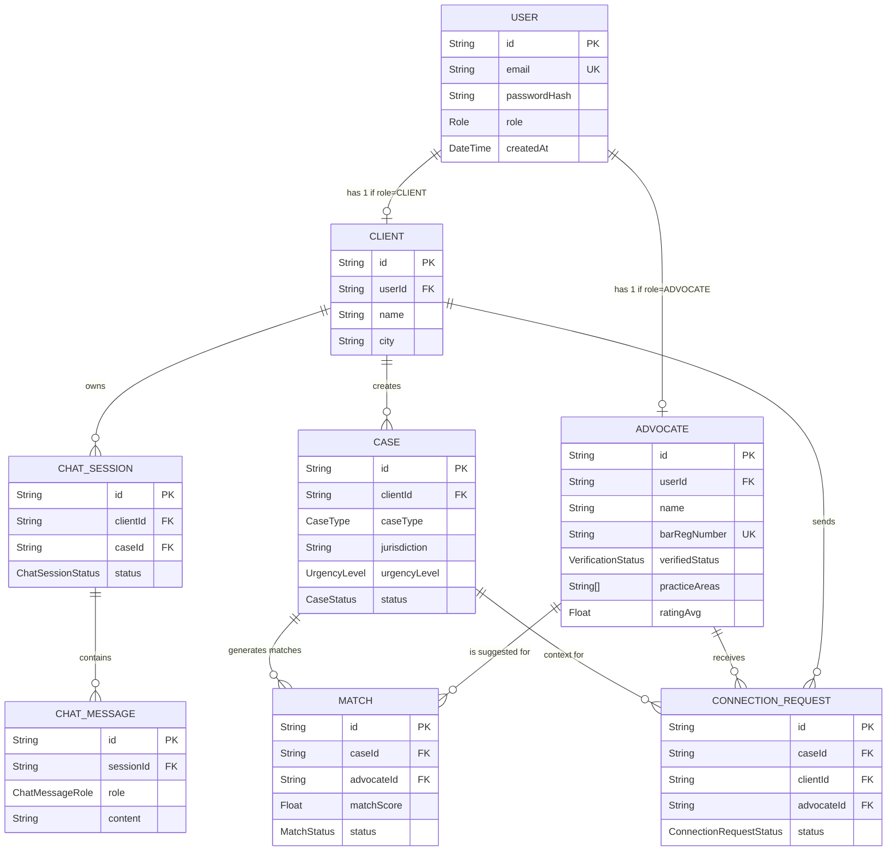

# Entity-Relationship (ER) Diagram

This diagram represents the actual Prisma database schema used in the Advocate Finder platform.

```mermaid
erDiagram
    USER {
        String id PK
        String email UK
        String passwordHash
        Role role
        DateTime createdAt
    }
    
    CLIENT {
        String id PK
        String userId FK
        String name
        String city
    }
    
    ADVOCATE {
        String id PK
        String userId FK
        String name
        String barRegNumber UK
        VerificationStatus verifiedStatus
        String[] practiceAreas
        Float ratingAvg
    }
    
    CASE {
        String id PK
        String clientId FK
        CaseType caseType
        String jurisdiction
        UrgencyLevel urgencyLevel
        CaseStatus status
    }
    
    CHAT_SESSION {
        String id PK
        String clientId FK
        String caseId FK
        ChatSessionStatus status
    }
    
    CHAT_MESSAGE {
        String id PK
        String sessionId FK
        ChatMessageRole role
        String content
    }
    
    MATCH {
        String id PK
        String caseId FK
        String advocateId FK
        Float matchScore
        MatchStatus status
    }
    
    CONNECTION_REQUEST {
        String id PK
        String caseId FK
        String clientId FK
        String advocateId FK
        ConnectionRequestStatus status
    }

    USER ||--o| CLIENT : "has 1 if role=CLIENT"
    USER ||--o| ADVOCATE : "has 1 if role=ADVOCATE"
    
    CLIENT ||--o{ CASE : "creates"
    CLIENT ||--o{ CHAT_SESSION : "owns"
    CLIENT ||--o{ CONNECTION_REQUEST : "sends"
    
    ADVOCATE ||--o{ MATCH : "is suggested for"
    ADVOCATE ||--o{ CONNECTION_REQUEST : "receives"
    
    CASE ||--o{ MATCH : "generates matches"
    CASE ||--o{ CONNECTION_REQUEST : "context for"
    
    CHAT_SESSION ||--o{ CHAT_MESSAGE : "contains"
```
